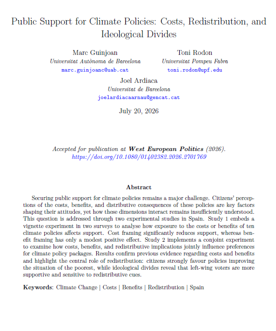
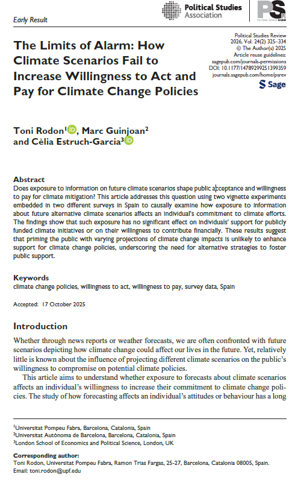

```{=html}
<div id="papers-layout">

<!-- ── Sidebar ─────────────────────────────────────────────────────────── -->
<aside id="papers-sidebar" class="headroom-target">
  <p class="sidebar-title">Filtrar</p>

  <div class="filter-group">
    <span class="filter-label">Estado</span>
    <select class="filter-select" data-filter="status">
      <option value="all">Todos</option>
      <option value="published">Publicados</option>
      <option value="working">Documentos de trabajo</option>
    </select>
  </div>

  <div class="filter-group">
    <span class="filter-label">Enfoque</span>
    <select class="filter-select" data-filter="approach">
      <option value="all">Todos</option>
      <option value="survey">Datos de encuesta</option>
      <option value="aggregate">Datos agregados</option>
    </select>
  </div>

  <div class="filter-group">
    <span class="filter-label">Autor/a</span>
    <select class="filter-select" data-filter="author">
      <option value="all">Todos</option>
      <option value="ardiaca">Ardiaca</option>
      <option value="biering">Biering</option>
      <option value="guinjoan">Guinjoan</option>
      <option value="mas">Mas</option>
      <option value="rodon">Rodon</option>
      <option value="romanin">Romanin</option>
    </select>
  </div>

  <button id="reset-filters" class="btn btn-sm btn-outline-secondary">Restablecer</button>
</aside>

<!-- ── Papers list ──────────────────────────────────────────────────────── -->
<div id="papers-list">

<p id="no-results" style="display:none; color:#aaa; font-style:italic;">Ningún artículo coincide con los filtros actuales.</p>

<!-- ── PUBLISHED ─────────────────────────────────────────────────── -->
<h5 class="section-heading">Publicados</h5>


<div class="paper-card"
     data-status="published"
     data-approach="survey"
     data-authors="guinjoan rodon ardiaca">

  <h6 class="paper-title">Public Support for Climate Policies: Costs, Redistribution, and Ideological Divides</h6>
  <p class="paper-authors">Marc Guinjoan, Toni Rodon, Joel Ardiaca</p>
 <p class="paper-venue"><em>West European Politics</em> (2026). <a href="https://doi.org/10.1080/01402382.2026.2701769" target="_blank">https://doi.org/10.1080/01402382.2026.2701769</a></p>

  <div class="paper-card-with-cover">
  
  <div class="paper-card-body">

  <p>A pesar del amplio reconocimiento público del cambio climático como un problema grave, el apoyo a políticas de mitigación concretas sigue siendo limitado y controvertido. Este artículo sostiene que los costes percibidos de una política, sus beneficios previstos y sus consecuencias distributivas determinan conjuntamente si la ciudadanía apoya o se opone a las medidas climáticas — dimensiones que la investigación existente ha estudiado de forma aislada.</p>
  <p>Los autores abordan esta cuestión mediante dos estudios experimentales en España. El Estudio 1 examina cómo la exposición a los costes o beneficios de diez políticas climáticas concretas afecta al apoyo declarado: el encuadre en términos de coste reduce significativamente el apoyo, mientras que el encuadre en términos de beneficio produce un efecto positivo más modesto. El Estudio 2 aplica un experimento conjoint que permite a las personas encuestadas sopesar costes, beneficios e implicaciones redistributivas al evaluar paquetes de política climática.</p>
  <p>Los resultados del experimento conjoint muestran que la redistribución desempeña un papel central: la ciudadanía favorece claramente las políticas que mejoran la situación de los más desfavorecidos, lo que sugiere posibles estrategias de construcción de coaliciones en torno a políticas eco-sociales. Las divisiones ideológicas son considerables: el electorado de izquierdas muestra un mayor apoyo general y una mayor sensibilidad a las señales redistributivas, mientras que el electorado de derechas responde especialmente al encuadre en términos de coste.</p>
  </div>
  </div>
</div>


<div class="paper-card"
     data-status="published"
     data-approach="survey"
     data-authors="rodon guinjoan estruch">

  <h6 class="paper-title">The Limits of Alarm: How Climate Scenarios Fail to Increase Willingness to Act and Pay for Climate Change Policies</h6>
  <p class="paper-authors">Toni Rodon, Marc Guinjoan, Cèlia Estruch-Garcia</p>
  <p class="paper-venue"><em>Political Studies Review</em>, Vol. 24(2), pp. 325–334 (2026). <a href="https://doi.org/10.1177/14789299251399359" target="_blank">https://doi.org/10.1177/14789299251399359</a></p>

  <div class="paper-card-with-cover">
  
  <div class="paper-card-body">

  <p>Un supuesto muy extendido en la comunicación sobre el clima es que confrontar al público con proyecciones vívidas de escenarios climáticos futuros aumentará su apoyo a las políticas de mitigación. Este artículo somete ese supuesto a una rigurosa prueba empírica. Mediante dos experimentos de viñetas integrados en encuestas representativas de la población española, los autores examinan de forma causal si la exposición a información sobre escenarios climáticos alternativos — desde moderados hasta catastróficos — afecta al compromiso de la ciudadanía con la acción climática en dos dimensiones clave: su apoyo a iniciativas climáticas financiadas con fondos públicos y su disposición a contribuir económicamente.</p>
  <p>Los resultados experimentales son sorprendentemente nulos. En ambas encuestas y ambas medidas de resultado, la exposición a información sobre escenarios climáticos futuros no tiene un efecto significativo sobre la disposición de las personas a actuar o a pagar. Este resultado se mantiene en los distintos grupos ideológicos: tanto el electorado de izquierdas como el de derechas resulta inafectado por los tratamientos de escenarios climáticos. Los autores descartan diversas explicaciones alternativas, incluidos los efectos techo y suelo, y concluyen que el resultado nulo es robusto y no un artefacto de la composición de la muestra.</p>
  <p>El artículo cuestiona el supuesto dominante según el cual las estrategias de comunicación basadas en el miedo o el riesgo pueden generar la voluntad política necesaria para políticas climáticas ambiciosas, y sugiere que otros enfoques — centrados en los cobeneficios, las normas sociales o el encuadre colectivo — podrían ser más eficaces para construir coaliciones públicas en favor de la acción climática.</p>
  </div>
  </div>
</div>

<hr class="section-divider">

<!-- ── WORKING PAPERS ─────────────────────────────────────────────── -->
<h5 class="section-heading">Documentos de trabajo</h5>

<div class="paper-card"
     data-status="working"
     data-approach="survey"
     data-authors="guinjoan ardiaca falco munoz rodon romanin">

  <h6 class="paper-title">Beliefs about Climate Change and Mitigation Policies: The Effect of the 2024 Valencia Floods</h6>
  <p class="paper-authors">Marc Guinjoan, Joel Ardiaca, Albert Falcó-Gimeno, Jordi Muñoz, Toni Rodon, Elena Romanin</p>

  <p>El 29 de octubre de 2024, la DANA provocó inundaciones catastróficas en la Comunidad Valenciana, causando la muerte de 227 personas en uno de los desastres naturales más mortíferos de la historia reciente de España. Los autores aprovechan una oportunidad única: una encuesta representativa de la población española ya estaba en el campo cuando se produjeron las inundaciones, lo que permite un análisis de tipo Unexpected Event during Survey Design (UESD) que compara a las personas encuestadas antes y después del desastre.</p>
  <p>Mediante un enfoque de diferencias en diferencias (DiD), el artículo estima cómo afectaron las inundaciones de Valencia a tres dimensiones distintas: el conocimiento y las creencias sobre el cambio climático, la percepción de la gravedad climática local y el apoyo a las políticas de mitigación. La granularidad geográfica de los datos permite a los autores distinguir entre las zonas afectadas y el resto de España, tratando la exposición geográfica como una asignación cuasi aleatoria.</p>
  <p>Los resultados revelan un patrón matizado. La percepción de la gravedad climática local aumentó significativamente entre las personas encuestadas en las zonas afectadas, lo que sugiere que la exposición directa a un evento catastrófico sí transforma la manera en que la ciudadanía evalúa el riesgo climático en su entorno inmediato. Sin embargo, las creencias generales sobre el origen y la relevancia global del cambio climático solo se vieron marginalmente afectadas. Una encuesta de seguimiento realizada varios meses después evalúa si estos cambios persisten o se desvanecen a medida que la crisis inmediata remite.</p>
</div>

<div class="paper-card"
     data-status="working"
     data-approach="survey"
     data-authors="guinjoan rodon">

  <h6 class="paper-title">Climate Conditions, Ideology and Attitudes towards Mitigation Policies: A Conjoint Experiment</h6>
  <p class="paper-authors">Marc Guinjoan, Toni Rodon</p>

  <p>¿Por qué la ciudadanía que respalda ampliamente la acción climática se resiste tan a menudo a medidas de mitigación concretas? Este artículo sostiene que la brecha entre el apoyo difuso y el apoyo específico a la política climática depende de los costes personales y los cambios en el estilo de vida que exigen las medidas concretas. Mediante un experimento conjoint integrado en una encuesta representativa de España (N = 4.764, enero de 2023), los autores varían simultáneamente tres dimensiones clave: la gravedad de las condiciones climáticas futuras previstas, el estado de la economía y la política de mitigación concreta propuesta.</p>
  <p>Las tres políticas abarcan las principales dimensiones de la intrusividad política: un impuesto de sociedades a las empresas contaminantes (coste trasladado a las empresas), una tasa por kilómetro para vehículos de combustibles fósiles (coste personal, movilidad) y una restricción del consumo de carne en bares y restaurantes (coste personal, estilo de vida). Este diseño permite a los autores estimar en qué medida cada atributo impulsa el apoyo de forma independiente, y cómo la ideología y las creencias climáticas moderan estos efectos.</p>
  <p>Los resultados revelan una marcada asimetría política. La ciudadanía apoya firmemente las políticas que trasladan los costes a las empresas, pero se resiste activamente a aquellas que exigen sacrificio personal o cambios en el estilo de vida. En línea con la «hipótesis del bajo coste», la brecha ideológica es mayor para el instrumento menos intrusivo y se reduce considerablemente para los más exigentes — lo que sugiere que las señales ideológicas importan más cuando lo que está en juego a nivel personal es menor.</p>
</div>

<div class="paper-card"
     data-status="working"
     data-approach="survey"
     data-authors="rodon guinjoan estruch sanjaume">

  <h6 class="paper-title">Do Natural Disasters Drive Support for Climate Change Policies?</h6>
  <p class="paper-authors">Toni Rodon, Marc Guinjoan, Cèlia Estruch-Garcia, Roger Sanjaume</p>

  <p>Una premisa central de buena parte de la comunicación sobre el clima es que la exposición directa a desastres naturales hará que la ciudadanía sea más receptiva a la acción climática. Este artículo somete esa premisa a una de las pruebas empíricas más exhaustivas hasta la fecha, utilizando datos de Estados Unidos para explotar la variación geográfica y temporal en la exposición a desastres a gran escala.</p>
  <p>Los autores combinan datos geográficos de gran detalle de FEMA — que cubren aproximadamente 15.000 desastres naturales declarados a nivel federal entre 2005 y 2022 — con datos de encuesta individuales del Cooperative Election Study (CES), que hacen seguimiento de unas 500.000 personas durante ese período. Emplean tres estrategias empíricas complementarias: un análisis observacional de gran N; un análisis de panel que explota los cambios intraindividuales; y un enfoque cuasiexperimental de tipo UESD.</p>
  <p>En los tres diseños de investigación, los resultados son consistentes: no existe una relación sistemática entre la ocurrencia de eventos climáticos extremos y los cambios en las creencias climáticas o el apoyo a políticas proambientales. El artículo contribuye a un debate creciente sobre los límites del aprendizaje experiencial en la política climática.</p>
</div>

<div class="paper-card"
     data-status="working"
     data-approach="survey"
     data-authors="biering guinjoan">

  <h6 class="paper-title">Don't Call It Degrowth! Evidence from a Framing and Labeling Experiment in Spain</h6>
  <p class="paper-authors">Gabriel Biering, Marc Guinjoan</p>

  <p>El destino político del decrecimiento puede depender menos de los méritos de las políticas subyacentes que de cómo se nombran y se comunican. Este artículo aísla estos mecanismos comunicativos mediante un diseño experimental depurado: un experimento de encuesta 2×2 en una muestra representativa de la población española (N = 3.000) que hace variar de forma independiente el encuadre (bienestar frente a reducción) y el etiquetado (con o sin la etiqueta «decrecimiento»).</p>
  <p>Los resultados son consistentes y claros. El apoyo es mayor bajo el encuadre de bienestar sin etiqueta. Describir el concepto principalmente en términos de reducción del consumo y la producción reduce sustancialmente la probabilidad de elegirlo, y añadir la etiqueta «decrecimiento» impone una penalización adicional. Un aspecto crucial es que estos efectos son similares entre los distintos subgrupos según su actitud climática: incluso la ciudadanía muy preocupada por el cambio climático es sensible a cómo se nombra y se encuadra el decrecimiento.</p>
</div>

<div class="paper-card"
     data-status="working"
     data-approach="aggregate"
     data-authors="mas guinjoan">

  <h6 class="paper-title">Expanding Global Coverage of Climate Change Support over Space and Time</h6>
  <p class="paper-authors">Jordi Mas, Marc Guinjoan</p>

  <p>El apoyo público es un factor determinante crucial para el éxito de la política climática, pero los datos existentes sobre actitudes climáticas están profundamente fragmentados — con formatos inconsistentes, sesgados hacia las democracias de renta alta y difíciles de comparar entre países y a lo largo del tiempo. Este artículo presenta un conjunto de datos panel de representatividad mundial que recoge las actitudes públicas hacia el cambio climático en más de 150 países entre 2010 y 2024.</p>
  <p>El conjunto de datos integra más de 8.000 observaciones de tipo país-año-ítem procedentes de 12 grandes encuestas internacionales, incluidas la World Risk Poll, el Latinobarómetro, el Afrobarometer y la Gallup World Poll. Para superar las inconsistencias en la redacción y las escalas de respuesta, los autores aplican un modelo bayesiano ordinal de Teoría de Respuesta al Ítem (IRT) con agrupamiento parcial, estimando una puntuación latente común para cada país-año incluso cuando faltan datos o las encuestas son inconsistentes.</p>
  <p>El conjunto de datos resultante amplía significativamente la cobertura geográfica, extiende la profundidad temporal con un panel longitudinal consistente de 2010 a 2024, y mejora notablemente la representación de los países de renta baja y media. Está disponible públicamente y constituye un recurso valioso para investigadores y responsables políticos implicados en la gobernanza climática global.</p>
</div>

<div class="paper-card"
     data-status="working"
     data-approach="aggregate"
     data-authors="rodon guinjoan mugica">

  <h6 class="paper-title">From Storms to the Floor: Natural Disasters and Climate Change Rhetoric in the US Congress</h6>
  <p class="paper-authors">Toni Rodon, Marc Guinjoan, Julia Mugica</p>

  <p>Aunque buena parte de la investigación ha examinado cómo afectan los desastres naturales a la opinión pública, se ha prestado mucha menos atención a si los eventos meteorológicos extremos condicionan el comportamiento de las élites políticas. Este artículo cubre ese vacío examinando la retórica sobre el cambio climático en la Cámara de Representantes de Estados Unidos a lo largo de casi cuatro décadas (1981–2017).</p>
  <p>Los autores combinan un extenso conjunto de datos de discursos parlamentarios con datos geográficamente detallados de desastres de FEMA, y aplican modelos de aprendizaje automático basados en PLN y transformers para identificar el discurso relacionado con el clima. Esto les permite explotar la variación temporal y geográfica en la exposición a desastres — cuándo estos afectan a distritos representados por miembros en activo del Congreso.</p>
  <p>Los grandes desastres sí llevan a los legisladores — en particular a los miembros republicanos — a hacer referencia al cambio climático con más frecuencia en sus discursos. Esta asimetría partidista sugiere que los eventos extremos pueden activar un compromiso retórico incluso entre los escépticos climáticos. Sin embargo, la retórica impulsada por los desastres no es necesariamente favorable a la acción climática — en algunos casos parece reactiva o desdeñosa.</p>
</div>

<div class="paper-card"
     data-status="working"
     data-approach="aggregate"
     data-authors="sorribas rodon guinjoan">

  <h6 class="paper-title">From Rubbish to the Ballot Box: The Electoral Effects of Door-to-Door Waste Policies</h6>
  <p class="paper-authors">Pilar Sorribas-Navarro, Toni Rodon, Marc Guinjoan</p>

  <p>Los sistemas de recogida de residuos puerta a puerta (DtD) se han extendido por las ciudades europeas como herramienta principal para cumplir los objetivos de reciclaje de la UE, obligando a los hogares a separar los residuos en varias fracciones en días designados — un cambio de política visible, incómodo y a menudo controvertido. A pesar de su proliferación, las consecuencias electorales de la implantación del DtD han permanecido en gran medida sin estudiar.</p>
  <p>Este artículo examina si y cómo los sistemas de puerta a puerta afectan a los resultados electorales en Cataluña, España — un contexto en el que la política ha sido adoptada progresivamente por los municipios desde principios de la década de 2000. Utilizando datos a nivel de sección censal y un diseño de diferencias en diferencias escalonado que aprovecha la implantación secuencial del sistema, los autores estiman el efecto electoral de la implantación del puerta a puerta en múltiples convocatorias electorales.</p>
  <p>La implantación del sistema puerta a puerta conlleva una penalización electoral medible para el partido que la implementa, especialmente a corto plazo. Este coste electoral está condicionado por el tiempo que lleva implantado el sistema, por si el partido que lo implementa había hecho campaña previamente sobre cuestiones medioambientales, y por el capital social del municipio. Los resultados tienen implicaciones importantes para la política de la reforma medioambiental.</p>
</div>

<div class="paper-card"
     data-status="working"
     data-approach="survey"
     data-authors="guinjoan rodon">

  <h6 class="paper-title">The Price of Climate Policies: Willingness to Trade Off Income for Environmental Quality</h6>
  <p class="paper-authors">Marc Guinjoan, Toni Rodon</p>

  <p>¿Cuánta renta está la ciudadanía realmente dispuesta a sacrificar por mejores condiciones climáticas? Este artículo responde a esta pregunta mediante un novedoso experimento conjoint integrado en la encuesta ATTCLIMATE 2024 (N = 3.002 personas encuestadas en España). Las personas encuestadas evaluaron pares de ciudades hipotéticas que variaban aleatoriamente en seis atributos: calidad del aire, preparación ante eventos meteorológicos extremos, infraestructura de refrigeración, zonas ciclistas y peatonales, salario mensual y tamaño de la ciudad.</p>
  <p>La renta es, con diferencia, el determinante más importante de la elección de ciudad: las personas encuestadas son muy sensibles a las diferencias de renta y requieren relativamente poca renta adicional para aceptar peores condiciones climáticas. Entre los atributos climáticos, la mala calidad del aire es el más relevante, seguido de la infraestructura de refrigeración, la preparación ante eventos extremos y la infraestructura ciclista — pero los cuatro requieren una compensación de renta modesta en comparación con la propia renta.</p>
  <p>Los análisis de heterogeneidad muestran que las personas encuestadas de izquierdas y quienes atribuyen el cambio climático a la actividad humana otorgan algo más de peso a los atributos climáticos, pero la renta sigue siendo el factor dominante en todos los grupos. Estos resultados cuestionan los relatos optimistas sobre un cambio «posmaterialista» y sugieren que el diseño de la política climática debe lidiar con la persistente priorización de la seguridad económica por parte de la ciudadanía.</p>
</div>

<div class="paper-card"
     data-status="working"
     data-approach="survey"
     data-authors="romanin">

  <h6 class="paper-title">Seeing Green? Misperceptions of Climate Change Beliefs and Behaviors in Spain</h6>
  <p class="paper-authors">Elena Romanin</p>

  <p>Este estudio examina si la ciudadanía tiene creencias precisas sobre la preocupación climática y los comportamientos sostenibles de los demás en España, y si corregir estas percepciones erróneas modifica el apoyo a la política climática. A partir de una encuesta representativa a nivel nacional con 2.656 personas encuestadas, combinada con un experimento factorial de viñetas preregistrado que hace variar el encuadre del mensaje (positivo frente a negativo) y la escala del grupo de referencia (nacional frente a regional), el análisis arroja dos resultados principales.</p>
  <p>En primer lugar, en contra del patrón de subestimación dominante en la literatura, la población española <em>sobre</em>estima sustancialmente tanto el porcentaje de ciudadanos que priorizan el cambio climático como principal problema social (percibido: 42 %; real: 22 %) como la prevalencia de los comportamientos sostenibles. Esta sobrestimación no obedece a un efecto de proyección: persiste entre las personas encuestadas que ni priorizan personalmente el cambio climático ni practican habitualmente los comportamientos examinados.</p>
  <p>En segundo lugar, proporcionar información normativa precisa no produce ningún efecto significativo sobre el apoyo a ninguna de las tres políticas evaluadas, con independencia del encuadre, el grupo de referencia o las creencias previas de las personas encuestadas. Estos resultados invitan a la cautela a la hora de asumir que los mensajes basados en normas sociales pueden por sí solos generar apoyo a la política climática, y amplían el ámbito geográfico de esta literatura al sur de Europa.</p>
</div>

<div class="paper-card"
     data-status="working"
     data-approach="survey"
     data-authors="romanin">

  <h6 class="paper-title">Healthier, Not Just Greener: Public Response to Different Benefit Framings in Carbon Tax Support in Spain</h6>
  <p class="paper-authors">Elena Romanin</p>

  <p>Los esfuerzos por implementar políticas climáticas suelen encontrar resistencia pública. Este estudio, basado en un experimento de encuesta preregistrado en España (N = 2.768), examina cómo distintos encuadres de la fiscalidad del carbono — que enfatizan los costes, los beneficios climáticos primarios, los cobeneficios y sus combinaciones — condicionan el apoyo público. En comparación con una condición de referencia sin información, los mensajes centrados en el coste reducen el apoyo, mientras que los encuadres de beneficio lo aumentan, en particular los que destacan cobeneficios locales como la mejora de la calidad del aire y de la salud pública.</p>
  <p>Los cobeneficios también resultan más eficaces para contrarrestar el impacto negativo de la relevancia del coste. Estos resultados sugieren que los resultados inmediatos y tangibles resuenan con más fuerza en el público que los objetivos climáticos lejanos. El análisis de las respuestas abiertas confirma esta interpretación: los cobeneficios resultaron más destacados cognitivamente, y las personas encuestadas los mencionaron con más frecuencia al explicar sus opiniones.</p>
  <p>El estudio también revela heterogeneidad en las respuestas: la información sobre costes reduce el apoyo especialmente entre las personas de izquierdas y de rentas más bajas, mientras que el encuadre de beneficio resulta más persuasivo entre las personas de derechas y de rentas más altas. En conjunto, estos resultados subrayan el papel modesto pero sistemático del encuadre a la hora de moldear las actitudes hacia la fiscalidad del carbono, y su potencial para orientar el diseño de políticas climáticas más aceptables socialmente.</p>
</div>

</div><!-- #papers-list -->
</div><!-- #papers-layout -->

<script>
(function () {
  const cards   = Array.from(document.querySelectorAll('.paper-card'));
  const selects = Array.from(document.querySelectorAll('.filter-select'));
  const noRes   = document.getElementById('no-results');
  const reset   = document.getElementById('reset-filters');

  // Section headings to show/hide based on visible cards beneath them
  function updateHeadings() {
    document.querySelectorAll('.section-heading, .section-divider').forEach(el => {
      el.style.display = '';
    });
    // Hide "Working Papers" heading if all WP cards hidden
    const wpVisible = cards.some(c => c.dataset.status === 'working' && c.style.display !== 'none');
    const pubVisible = cards.some(c => c.dataset.status === 'published' && c.style.display !== 'none');
    document.querySelectorAll('.section-heading').forEach(h => {
      if (h.textContent.trim() === 'Documentos de trabajo' && !wpVisible) h.style.display = 'none';
      if (h.textContent.trim() === 'Publicados' && !pubVisible) h.style.display = 'none';
    });
    // Hide divider if published section hidden
    if (!pubVisible) {
      const div = document.querySelector('.section-divider');
      if (div) div.style.display = 'none';
    }
  }

  function applyFilters() {
    // Build map: filterGroup -> selected value ('all' or a specific value)
    const values = {};
    selects.forEach(s => { values[s.dataset.filter] = s.value; });

    let anyVisible = false;
    cards.forEach(card => {
      const statusOk = values.status === 'all' || values.status === card.dataset.status;
      const approachOk = values.approach === 'all' || values.approach === card.dataset.approach;
      const cardAuthors = (card.dataset.authors || '').split(' ');
      const authorOk = values.author === 'all' || cardAuthors.includes(values.author);

      const show = statusOk && approachOk && authorOk;
      card.style.display = show ? '' : 'none';
      if (show) anyVisible = true;
    });

    noRes.style.display = anyVisible ? 'none' : '';
    updateHeadings();
  }

  selects.forEach(s => s.addEventListener('change', applyFilters));
  reset.addEventListener('click', () => {
    selects.forEach(s => { s.value = 'all'; });
    applyFilters();
  });

  applyFilters();
})();
</script>
```

:::: funding-footer
<p class="grant-line">

<strong>ATTCLIMATE</strong> · Project TED2021-132344A-I00 · MCIN/AEI/10.13039/501100011033 · European Union "NextGenerationEU"/PRTR

</p>

<p class="grant-line">

<strong>ATTCLIMPOLS</strong> · Project PID2025-173985OB-I00 · MCIN/AEI/10.13039/501100011033

</p>

::: funding-logos
{height="46"} {height="46"} {height="46"}
:::
::::
