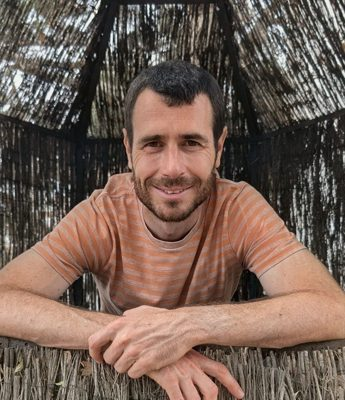
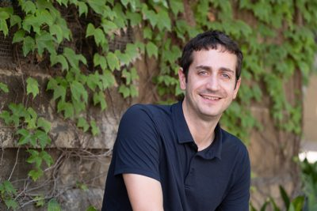
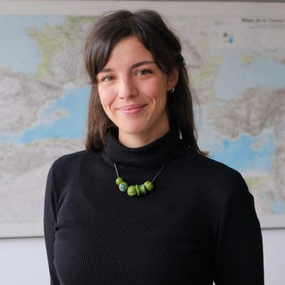
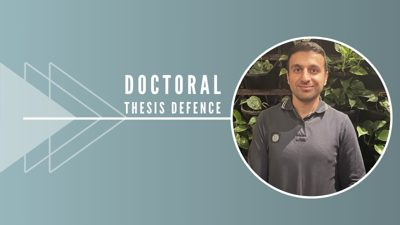
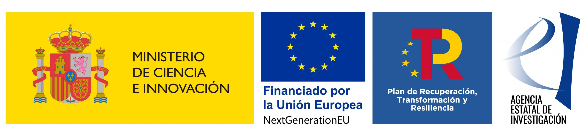

```{=html}
<style>
  .member {
    display: flex;
    gap: 1.1rem;
    align-items: flex-start;
    margin-bottom: 1.5rem;
  }
  .member-photo {
    width: 84px;
    height: 84px;
    border-radius: 50%;
    object-fit: cover;
    flex: none;
  }
  .member > p {
    margin: 0;
  }
  .member > p:first-of-type {
    flex: none;
  }
  .member > p:last-child {
    flex: 1;
  }
</style>
```

:::::::::: {style="text-align: justify; max-width: 860px; margin: 0 auto;"}
El equipo que se presenta a continuación ha desarrollado el proyecto **ATTCLIMATE** (2022–2025) y continúa su trabajo en el marco del nuevo proyecto financiado **ATTCLIMPOLS** (2026–2029).

## Investigadores principales

::: member
{.member-photo}

[**Marc Guinjoan (UAB)**](https://sites.google.com/site/marcguinjoan) fue coinvestigador principal de ATTCLIMATE y es investigador principal de ATTCLIMPOLS. Es profesor en el Departamento de Ciencia Política y Derecho Público de la Universitat Autònoma de Barcelona. Sus principales líneas de investigación incluyen el comportamiento político y electoral, los partidos políticos, los sistemas electorales, el populismo y la psicología política. También ha trabajado extensamente sobre procesos de descentralización, identidades y preferencias territoriales.
:::

::: member
{.member-photo}

[**Toni Rodon (UPF)**](https://tonirodon.cat/) fue coinvestigador principal de ATTCLIMATE. Rodon es profesor agregado (Associate Professor) en el Departamento de Ciencias Políticas y Sociales de la Universitat Pompeu Fabra, e investigador en la London School of Economics and Political Science (Reino Unido). Sus intereses de investigación incluyen el comportamiento político, la opinión pública, la economía política histórica y la geografía política, entre otros.
:::

------------------------------------------------------------------------

## Equipo actual

::: member
{.member-photo}

[**Jordi Mas (UOC)**](https://www.jordimas.cat/) es profesor en la Facultad de Derecho y Ciencia Política de la Universitat Oberta de Catalunya. Sus intereses de investigación incluyen la gobernanza de datos, la economía política y las instituciones políticas.
:::

::: member
{.member-photo}

[**Elena Romanin**](https://elenaromanin.github.io/index.html) es doctoranda en Ciencias Políticas y Sociales en la Universitat Pompeu Fabra. Previamente fue investigadora en el Research and Expertise Centre for Survey Methodology (UPF), donde colaboró en el proyecto de investigación ICOS Cities Pilot Applications in Urban Landscapes – Towards integrated city Observatories for greenhouse gases (PAUL). Ha cursado el Máster en Economía y Desarrollo en la Universidad de Florencia, y el Grado en Estudios Internacionales en la Universidad de Trento.
:::

::: member
{.member-photo}

[**Gabriel Biering**](https://directori.uab.cat/uabdirectori/veureDetallPersona?cid=354f67785a376b446c5564744f68727876434b6173413d3d&cole=P_INVESTIGADOR) es doctorando en el Departamento de Ciencia Política de la Universitat Autònoma de Barcelona. Es Máster de investigación en Instituciones y Economía Política M.Sc. (Universitat de Barcelona, 2024) y graduado en Filosofía, Política y Economía B.A. (Universität Witten/Herdecke, 2021). Su investigación se centra en la capacidad de respuesta democrática y el cambio climático.
:::

::: member
{.member-photo}

[**Joel Ardiaca**](https://joelardiaca.github.io/) es asistente de investigación. Actualmente trabaja como estadístico en el Centre d'Estudis d'Opinió y cursa el máster en Estadística e Investigación Operativa en la Universitat Politècnica de Catalunya. Ha completado el doble grado en Estadística y Sociología en la Universitat Autònoma de Barcelona.
:::

::: member
{.member-photo}

[**Nikandros Ioannidis**](https://nikandrosioannidis.com/) es doctor en Ciencias Políticas y Sociales por la Universitat Pompeu Fabra y es Special Teaching Staff en la Cyprus University of Technology. Su investigación se centra en el comportamiento político, la opinión pública y el análisis de actitudes relacionadas con el conflicto y el clima mediante métodos cuantitativos y computacionales avanzados. Cuenta con amplia experiencia en análisis espaciotemporal, integración de datos geocodificados y construcción de bases de datos a gran escala.
:::

------------------------------------------------------------------------

## Antiguos miembros

[**Roger Sanjaume**](https://rogersanjaume.cat/) fue programador analista de datos en el proyecto. Actualmente trabaja como ingeniero de datos en una cooperativa del sector eléctrico. Ha colaborado con proyectos de investigación como el Institutions and Political Economy Research Group (IPErG) como analista de datos.

[**Cèlia Estruch**](https://celiaestruch.cat/) fue asistente de investigación en el proyecto. Ha cursado el Máster en Ciencia Política y Economía Política en la London School of Economics and Political Science (Reino Unido), el posgrado en Análisis de Datos para el Análisis Político y la Gestión Pública en la Universidad de Barcelona, y el Grado en Filosofía, Política y Economía en la Universitat Pompeu Fabra.

[**Julia Múgica**](https://juliamugica.net/) es una científica y artista mexicana con formación interdisciplinar en biología, psicología y física computacional. Le interesa comprender cómo los colectivos toman decisiones que dan lugar a la sincronía conductual. Su investigación combina el análisis de datos, el comportamiento colectivo, los sistemas complejos y el procesamiento del lenguaje natural, tanto en contextos científicos como artísticos. Fue investigadora en el proyecto ATTCLIMATE, contribuyendo a un artículo que analiza los discursos de legisladores estadounidenses sobre cambio climático mediante procesamiento del lenguaje natural.

---

## Colaboradores

Personas que han colaborado con el proyecto en distintos momentos y niveles de implicación:

- [Arnau López Fabón](https://es.linkedin.com/in/arnaulopezfabon)
- [Irene Rodríguez López](http://irenerodriguez.cat/index.html)
- [Inés Arjona Torres](https://www.linkedin.com/in/in%C3%A9s-arjona-torres-959690264/)
::::::::::

:::: funding-footer
<p class="grant-line">

<strong>ATTCLIMATE</strong> · Project TED2021-132344A-I00 · MCIN/AEI/10.13039/501100011033 · European Union "NextGenerationEU"/PRTR

</p>

<p class="grant-line">

<strong>ATTCLIMPOLS</strong> · Project PID2025-173985OB-I00 · MCIN/AEI/10.13039/501100011033

</p>

::: funding-logos
{height="46"} {height="46"} {height="46"}
:::
::::
