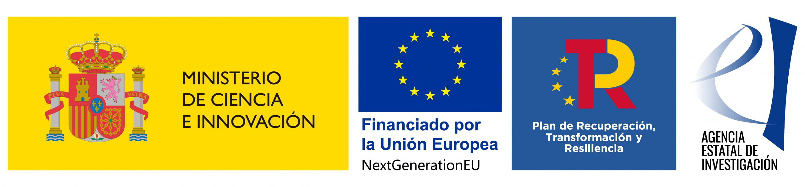

```{=html}
<style>
  /* Break hero out of Quarto's content container */
  .hero-section {
    background-image:
      linear-gradient(180deg, rgba(10,10,20,0.55) 0%, rgba(10,10,20,0.25) 45%, rgba(10,10,20,0.75) 100%),
      url("img/sequera.jpeg");
    background-size: cover;
    background-position: center 35%;
    background-repeat: no-repeat;
    min-height: min(64vh, 520px);
    display: flex;
    align-items: center;
    justify-content: center;
    position: relative;
    margin-top: -64px;
    width: 100vw;
    margin-left: calc(-50vw + 50%);
  }
  .hero-text {
    position: relative;
    text-align: center;
    color: #ffffff;
    padding: 2rem;
    max-width: 780px;
  }
  .hero-eyebrow {
    display: inline-block;
    font-size: 0.78rem;
    font-weight: 600;
    letter-spacing: 0.12em;
    text-transform: uppercase;
    color: rgba(255,255,255,0.85);
    background: rgba(255,255,255,0.12);
    border: 1px solid rgba(255,255,255,0.3);
    border-radius: 999px;
    padding: 0.3rem 0.9rem;
    margin-bottom: 1.1rem;
    backdrop-filter: blur(2px);
  }
  .hero-text h1 {
    font-size: 2.6rem;
    font-weight: 700;
    margin-bottom: 0.9rem;
    letter-spacing: 0.2px;
    text-shadow: 0 2px 18px rgba(0,0,0,0.35);
  }
  .hero-text p {
    font-size: 1.15rem;
    opacity: 0.92;
    line-height: 1.6;
  }
  .scroll-hint {
    position: absolute;
    bottom: 1.25rem;
    left: 50%;
    transform: translateX(-50%);
    color: rgba(255,255,255,0.7);
    font-size: 0.8rem;
    letter-spacing: 1px;
    text-transform: uppercase;
  }
  .project-body {
    max-width: 900px;
    margin: 0 auto;
    padding: 3.5rem 2rem 1rem;
    line-height: 1.85;
  }
  .project-body h2 {
    font-size: 1.55rem;
    margin-top: 2.75rem;
    margin-bottom: 0.9rem;
    border-bottom: 1px solid var(--surface-divider);
    padding-bottom: 0.4rem;
  }
  .project-body .lede {
    font-size: 1.08rem;
    color: var(--muted-text);
  }
  /* Two-project cards */
  .project-grid {
    display: grid;
    grid-template-columns: repeat(auto-fit, minmax(280px, 1fr));
    gap: 1.25rem;
    margin: 1.5rem 0 2.5rem;
  }
  .project-card {
    padding: 1.4rem 1.5rem;
  }
  .project-card .badge-status {
    display: inline-block;
    font-size: 0.72rem;
    font-weight: 700;
    letter-spacing: 0.06em;
    text-transform: uppercase;
    border-radius: 999px;
    padding: 0.2rem 0.7rem;
    margin-bottom: 0.6rem;
  }
  .badge-status.ongoing { background: rgba(46, 160, 67, 0.18); color: #2ea043; }
  .badge-status.new { background: rgba(0, 123, 255, 0.18); color: #3b8bff; }
  .project-card h3 {
    font-size: 1.1rem;
    margin-bottom: 0.5rem;
  }
  .project-card p {
    font-size: 0.94rem;
    margin-bottom: 0;
  }
  /* Research line cards */
  .rl-grid {
    display: grid;
    grid-template-columns: repeat(auto-fit, minmax(240px, 1fr));
    gap: 1.1rem;
    margin: 1.25rem 0 1rem;
  }
  .rl-card {
    padding: 1.25rem 1.35rem;
  }
  .rl-card .rl-num {
    font-size: 0.78rem;
    font-weight: 700;
    letter-spacing: 0.08em;
    color: var(--muted-text);
    margin-bottom: 0.4rem;
  }
  .rl-card p {
    font-size: 0.92rem;
    margin-bottom: 0;
  }
  /* Hide Quarto's auto-generated title */
  .quarto-title-block {
    display: none;
  }
  /* Panel structure diagram */
  .panel-diagram-wrap {
    padding: 1.75rem 1.5rem 1.25rem;
    margin: 1.5rem 0 1.75rem;
    overflow-x: auto;
  }
  .panel-diagram-wrap svg {
    display: block;
    margin: 0 auto;
    max-width: 700px;
    width: 100%;
    height: auto;
  }
  .panel-diagram-wrap .arc-label,
  .panel-diagram-wrap .node-period,
  .panel-diagram-wrap .node-n {
    fill: var(--muted-text);
  }
  .panel-diagram-wrap .node-label {
    fill: #ffffff;
  }
  .panel-diagram-wrap .arc-line {
    fill: none;
    stroke: var(--muted-text);
    stroke-width: 1.5;
    stroke-dasharray: 4 3;
  }
  .panel-stats {
    display: grid;
    grid-template-columns: repeat(auto-fit, minmax(200px, 1fr));
    gap: 0.9rem;
    margin: 1.25rem 0 0.5rem;
  }
  .panel-stat {
    padding: 0.9rem 1.1rem;
    text-align: center;
  }
  .panel-stat .stat-value {
    font-size: 1.3rem;
    font-weight: 700;
  }
  .panel-stat .stat-label {
    font-size: 0.8rem;
    color: var(--muted-text);
    margin-top: 0.2rem;
  }
</style>
<div class="hero-section">
  <div class="hero-text">
    <span class="hero-eyebrow">ATTCLIMATE &middot; ATTCLIMPOLS</span>
    <h1>Attitudes, Climate Change and Support for Mitigation Policies</h1>
    <p>Tracking how citizens and political elites in Spain respond to climate change &mdash; and what it takes to turn public concern into durable policy support.</p>
  </div>
  <div class="scroll-hint">&darr; scroll to explore</div>
</div>
```

:::::::::: project-body
## What is this project about?

**ATTClimate** *(Political Attitudes, Climate Change, and Support for Mitigation Policies)* investigates how Spanish citizens form their opinions about climate change and the public policies designed to address it. At its core, the project asks: *who supports climate policies, why, and under what conditions?*

Climate change is one of the defining challenges of our time, yet the implementation of effective mitigation policies depends critically on public support. Policies such as carbon taxes, low-emission zones, renewable energy subsidies, or restrictions on fossil fuels all entail real costs and trade-offs that citizens must accept for democracies to enact them. This research programme seeks to understand the political, social, and psychological factors that shape whether individuals back or oppose these measures.

The programme comprises two consecutive projects. **ATTCLIMATE** (2022–2025) was based at the **Universitat Oberta de Catalunya (UOC)** and the **Universitat Pompeu Fabra (UPF)**, co-directed by Marc Guinjoan and Toni Rodon. **ATTCLIMPOLS** (2026–2029) is based at the **Universitat Autònoma de Barcelona (UAB)**, led by Marc Guinjoan as principal investigator.

::::: project-grid
::: {.project-card .surface-card}
[2022 – 2025]{.badge-status .ongoing}

<h3>ATTCLIMATE</h3>

<p>The original project (TED2021-132344A-I00), co-directed by Marc Guinjoan (UAB) and Toni Rodon (UPF). It fielded four nationally representative panel survey waves (2023–2025) on climate attitudes and policy support, producing one of the first panel-format climate surveys in the world.</p>
:::

::: {.project-card .surface-card}
[2026 – 2029 · New]{.badge-status .new}

<h3>ATTCLIMPOLS</h3>

<p><em>From Attitudes to Action in Climate Politics</em> (PID2025-173985OB-I00) builds directly on ATTCLIMATE. It extends the Spanish panel with at least three further waves (2026–2028), constructs a harmonised cross-country database of climate attitudes covering 100+ countries, and deepens the study of political elites' responses to climate change.</p>
:::
:::::

## Research Lines

:::::: rl-grid
::: {.rl-card .surface-card}
<p><a href="data_en.qmd"><strong>Longitudinal survey data.</strong></a> A seven-wave Spanish panel (2023–2029) tracking how attitudes evolve over time, including how exposure to extreme weather events — such as the October 2024 DANA floods — shapes climate beliefs and policy support.</p>
:::

::: {.rl-card .surface-card}
<p><a href="map.qmd"><strong>Quality data for climate research.</strong></a> A harmonised, cross-country database of climate attitudes covering 100+ countries, providing a robust empirical foundation for climate change research worldwide.</p>
:::

::: {.rl-card .surface-card}
<p><a href="papers.qmd"><strong>Support for public policy.</strong></a> A deeper look at what drives support for climate mitigation policies — from cost and redistribution framing to how political parties and representatives respond to climate change.</p>
:::
::::::

## Data

ATTClimate has fielded four waves of original survey data (2023–2025) among the Spanish population, accumulating over 15,000 respondent-wave observations, with at least three further waves planned under ATTCLIMPOLS (2026–2029). All harmonised data are available through the [CORA research data repository](https://cora.csuc.cat/repositoris/) — see the [CORA Data](data_en.qmd) page for details. You can also explore the survey data interactively via the [Panel data analysis](https://mguinjoan.shinyapps.io/attclimate/) app.

### Panel structure

The ATTCLIMATE survey has a panel structure, which allows researchers to track attitude change over time and link individual survey responses to real-world climate events. The figure below shows the number of interviews in each of the 4 waves: upper arcs show how the number of panelists answered two consecutive waves. In total, 737 respondents have completed all four waves of the ATTCLIMATE panel survey.

```{=html}
<div class="panel-diagram-wrap surface-card">
<svg viewBox="0 0 880 315" role="img" aria-label="Diagram of the ATTCLIMATE panel structure across four survey waves, showing sample size per wave and the number of repeated respondents linking each pair of waves.">
  <!-- Top arcs: consecutive waves -->
  <path class="arc-line" d="M110,116 Q220,42 330,116" />
  <text class="arc-label" x="220" y="58" text-anchor="middle" font-size="15" font-weight="600">1,655</text>
  <path class="arc-line" d="M330,116 Q440,42 550,116" />
  <text class="arc-label" x="440" y="58" text-anchor="middle" font-size="15" font-weight="600">1,996</text>
  <path class="arc-line" d="M550,116 Q660,42 770,116" />
  <text class="arc-label" x="660" y="58" text-anchor="middle" font-size="15" font-weight="600">1,905</text>

  <!-- Bottom arc: W1-W4 -->
  <path class="arc-line" d="M110,184 Q440,272 770,184" />
  <text class="arc-label" x="440" y="286" text-anchor="middle" font-size="14" font-style="italic">1,570 respondents answered both Wave 1 and Wave 4</text>

  <!-- Nodes -->
  <circle cx="110" cy="150" r="34" fill="#002B6E" />
  <text class="node-label" x="110" y="156" text-anchor="middle" font-size="15" font-weight="700">W1</text>
  <text class="node-period" x="110" y="205" text-anchor="middle" font-size="12.5">Feb &#39;23</text>
  <text class="node-n" x="110" y="224" text-anchor="middle" font-size="12.5">N = 4,764</text>

  <circle cx="330" cy="150" r="34" fill="#0054A8" />
  <text class="node-label" x="330" y="156" text-anchor="middle" font-size="15" font-weight="700">W2</text>
  <text class="node-period" x="330" y="205" text-anchor="middle" font-size="12.5">Apr &#39;24</text>
  <text class="node-n" x="330" y="224" text-anchor="middle" font-size="12.5">N = 3,019</text>

  <circle cx="550" cy="150" r="34" fill="#4D8FCC" />
  <text class="node-label" x="550" y="156" text-anchor="middle" font-size="15" font-weight="700">W3</text>
  <text class="node-period" x="550" y="205" text-anchor="middle" font-size="12.5">Oct&#8211;Nov &#39;24</text>
  <text class="node-n" x="550" y="224" text-anchor="middle" font-size="12.5">N = 3,644</text>

  <circle cx="770" cy="150" r="34" fill="#8AB5DE" />
  <text x="770" y="156" text-anchor="middle" font-size="15" font-weight="700" fill="#002B6E">W4</text>
  <text class="node-period" x="770" y="205" text-anchor="middle" font-size="12.5">May &#39;25</text>
  <text class="node-n" x="770" y="224" text-anchor="middle" font-size="12.5">N = 3,997</text>
</svg>
</div>
```

The lower arc shows how many panelists answered both the first and the last wave, Wave 1 and Wave 4 — the two waves furthest apart in time.
::::::::::

:::: funding-footer
<p class="grant-line">

<strong>ATTCLIMATE</strong> · Project TED2021-132344A-I00 · MCIN/AEI/10.13039/501100011033 · European Union "NextGenerationEU"/PRTR

</p>

<p class="grant-line">

<strong>ATTCLIMPOLS</strong> · Project PID2025-173985OB-I00 · MCIN/AEI/10.13039/501100011033

</p>

::: funding-logos
{width="220"}
:::
::::