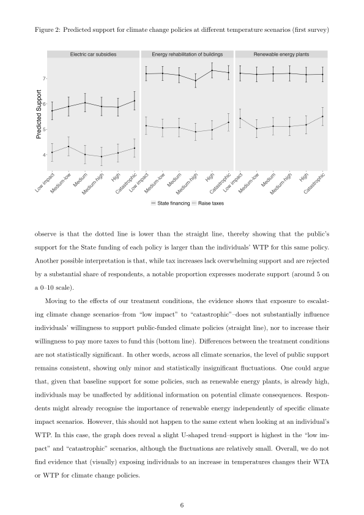
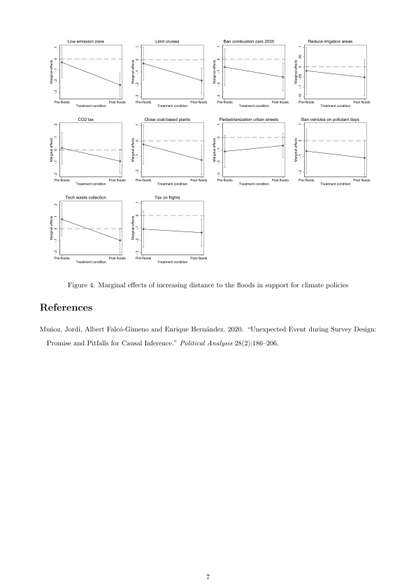
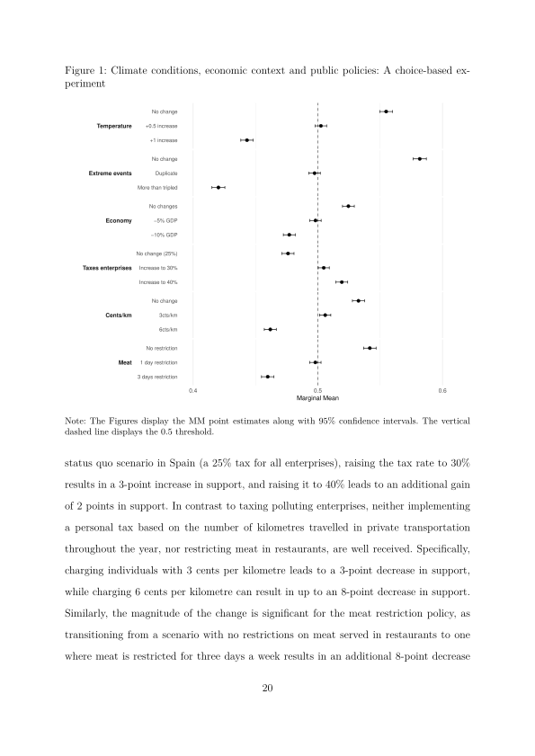
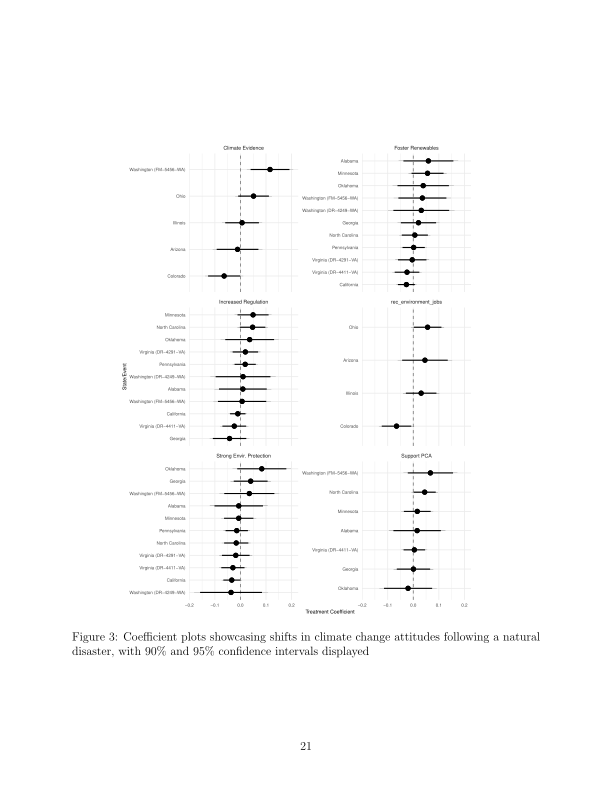
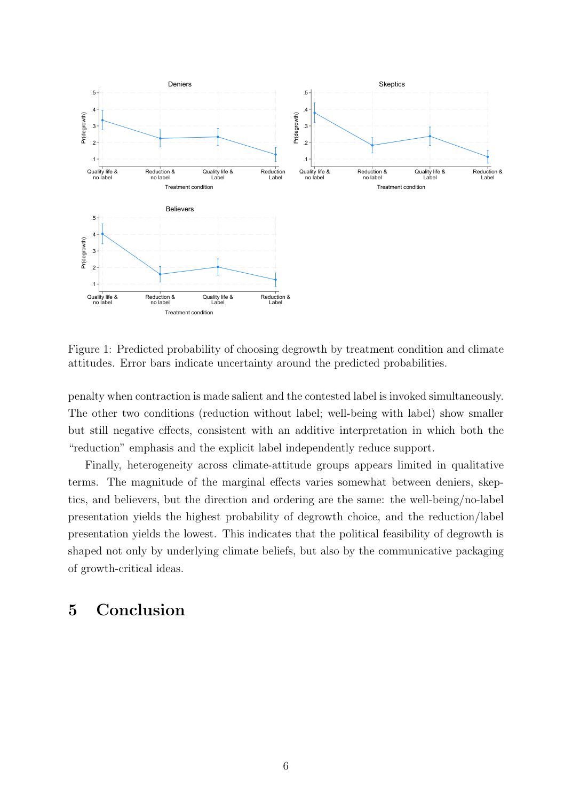
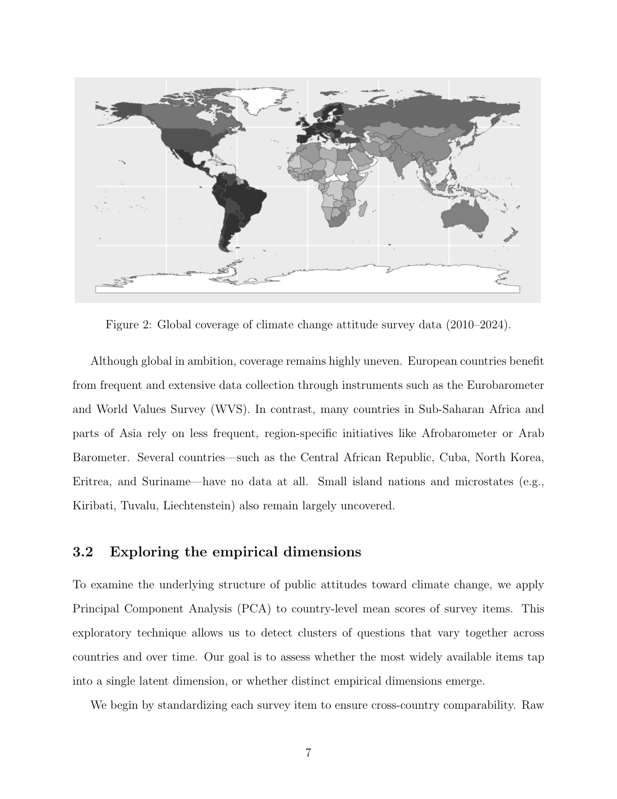
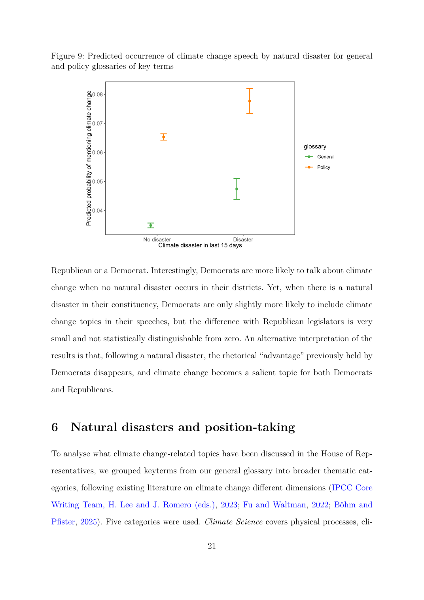
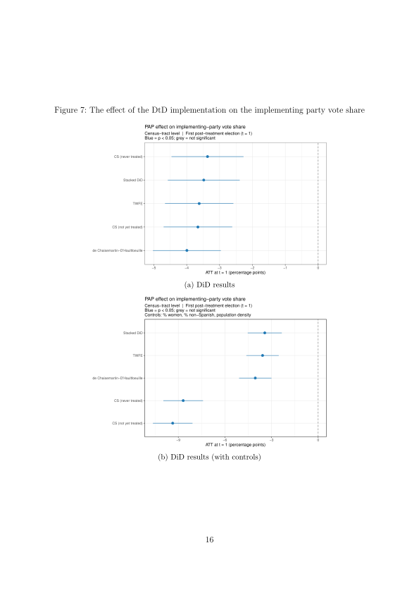
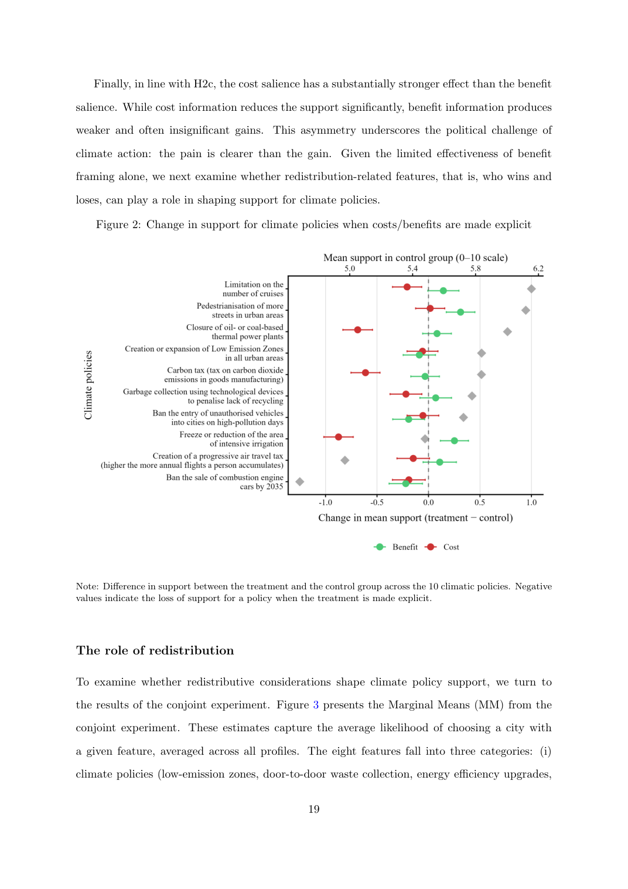
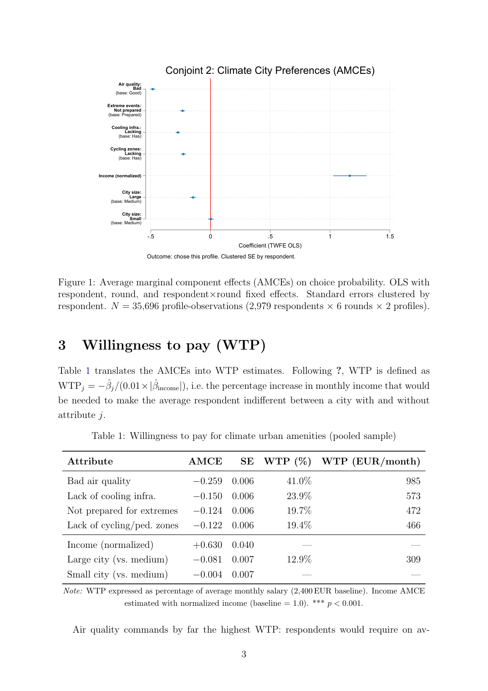

::: {style="max-width: 900px; margin: 0 auto;"}
## Published

------------------------------------------------------------------------

### The Limits of Alarm: How Climate Scenarios Fail to Increase Willingness to Act and Pay for Climate Change Policies

**Toni Rodon, Marc Guinjoan, Cèlia Estruch-Garcia**

*Political Studies Review*, Vol. 24(2), pp. 325–334 (2026). <https://doi.org/10.1177/14789299251399359>

A widespread assumption in climate communication is that confronting the public with vivid projections of future climate scenarios will increase their support for mitigation policies. This article puts that assumption to a rigorous empirical test. Using two vignette experiments embedded in representative surveys of the Spanish population, the authors causally examine whether exposure to information about alternative climate scenarios — ranging from moderate to catastrophic — affects citizens' commitment to climate action in two key dimensions: their support for publicly funded climate initiatives, and their willingness to contribute financially.

The experimental results are strikingly null. Across both surveys and both outcome measures, exposure to future climate scenario information has no significant effect on individuals' willingness to act or to pay. This finding holds across different ideological groups: left-wing and right-wing respondents alike are unaffected by the climate scenario treatments. The authors rule out a range of alternative explanations, including ceiling effects (respondents who already support climate action) and floor effects (hardened sceptics who cannot be moved), finding that the null result is robust and not an artifact of sample composition.

The article makes two main contributions. Theoretically, it challenges the prevailing assumption that fear-based or risk-based messaging strategies can generate the political will for ambitious climate policies. Empirically, it provides rare null results on a question that has attracted much speculation but little rigorous evidence. The findings have direct implications for communication strategies in climate politics: priming citizens with projections of climate change impacts is unlikely to translate into greater support for costly policies, and alternative approaches — perhaps those centred on co-benefits, social norms, or collective framing — may be more effective in building public coalitions behind climate action.

```{=html}
<figure style="margin: 1.5rem 0; text-align: center;">
  
  <figcaption style="font-size: 0.85rem; color: #666; margin-top: 0.5rem;">
    Figure 2: Predicted support for climate change policies at different scenario levels. The figure shows that exposure to alarming vs. moderate climate scenarios produces no significant difference in policy support.
  </figcaption>
</figure>
```

------------------------------------------------------------------------

## Working Papers

------------------------------------------------------------------------

### Beliefs about Climate Change and Mitigation Policies: The Effect of the 2024 Valencia Floods

**Marc Guinjoan, Joel Ardiaca, Albert Falcó-Gimeno, Jordi Muñoz, Toni Rodon, Elena Romanin**

On 29 October 2024, the DANA storm system brought catastrophic flooding to the Valencia region, killing 227 people in one of the deadliest natural disasters in Spain's modern history. The authors exploit a unique opportunity: a representative survey of the Spanish population was already in the field when the floods struck, enabling an Unexpected Event during Survey Design (UESD) analysis that compares respondents interviewed before and after the disaster.

Using a difference-in-differences (DiD) approach, the paper estimates how the Valencia floods affected three distinct dimensions: awareness of and beliefs about climate change, perceptions of local climate severity, and support for mitigation policies. The geographic granularity of the data allows the authors to distinguish between affected areas — those directly inundated or in close proximity to flood zones — and unaffected parts of Spain, treating geographic exposure as quasi-random assignment.

The findings reveal a nuanced pattern. Perceptions of local climate severity increased significantly among respondents in affected areas relative to those elsewhere, suggesting that direct exposure to a catastrophic event does reshape how citizens assess climate risk in their immediate surroundings. However, general beliefs about the origin and global salience of climate change — whether it is human-caused, how serious a threat it poses — were only marginally affected, indicating that the disaster's impact on more abstract climate cognition was limited. Support for specific mitigation policies increased modestly in the aftermath of the floods, but the effect was concentrated in particular policy areas and subgroups of the population. A follow-up survey conducted several months later allows the authors to assess whether these changes persist or fade as the immediate crisis recedes.

```{=html}
<figure style="margin: 1.5rem 0; text-align: center;">
  
  <figcaption style="font-size: 0.85rem; color: #666; margin-top: 0.5rem;">
    Difference-in-differences estimates comparing pre/post-flood changes in climate attitudes and policy support between affected and unaffected areas.
  </figcaption>
</figure>
```

------------------------------------------------------------------------

### Climate Conditions, Ideology and Attitudes towards Mitigation Policies: A Conjoint Experiment

**Marc Guinjoan, Toni Rodon**

Why do citizens who broadly endorse climate action so often resist specific mitigation measures? This paper argues that the gap between diffuse and specific support for climate policy hinges on the personal costs and lifestyle changes that concrete measures require. Using a conjoint experiment embedded in a representative survey of Spain (N = 4,764, January 2023), the authors systematically vary three key dimensions simultaneously: the severity of projected future climate conditions, the state of the economy, and the specific mitigation policy on offer.

The three policies were deliberately selected to span the main dimensions of policy intrusiveness: a corporate tax on polluting enterprises (cost shifted to firms), a per-kilometre charge on fossil fuel vehicles (personal cost, mobility), and a restriction on meat in bars and restaurants (personal cost, lifestyle). This design allows the authors to estimate how much each attribute independently drives support, and how ideology and climate beliefs moderate these effects.

The results reveal a sharp and politically important asymmetry. Citizens strongly support policies that shift costs onto corporations, but actively resist those requiring personal sacrifice or lifestyle adjustment. Left-leaning individuals and climate believers are somewhat more willing to accept intrusive measures, but even they fall short of net support for personally costly policies. Consistent with the "low-cost hypothesis," the ideological gap is widest for the least intrusive instrument and narrows considerably for the most demanding ones — suggesting that ideological cues matter most when personal stakes are lowest. Finally, exposure to catastrophic future scenarios produces only modest adjustments in support, reinforcing the conclusion that fear-based messaging alone cannot build public acceptance for climate policies that require real personal trade-offs.

```{=html}
<figure style="margin: 1.5rem 0; text-align: center;">
  
  <figcaption style="font-size: 0.85rem; color: #666; margin-top: 0.5rem;">
    Figure 1: Marginal Means for the three climate policies across climate condition, economic context, and ideology. Citizens support shifting costs to corporations but resist personal sacrifice.
  </figcaption>
</figure>
```

------------------------------------------------------------------------

### Do Natural Disasters Drive Support for Climate Change Policies?

**Toni Rodon, Marc Guinjoan, Cèlia Estruch-Garcia, Roger Sanjaume**

A central premise of much climate communication is that direct exposure to natural disasters — floods, wildfires, hurricanes — will make citizens more receptive to climate action. This paper puts that premise to one of the most comprehensive empirical tests to date, using data from the United States to exploit geographic and temporal variation in disaster exposure on a massive scale.

The authors combine fine-grained geographic data from the Federal Emergency Management Agency (FEMA) — covering approximately 15,000 federally declared natural disasters between 2005 and 2022 — with individual-level survey data from the Cooperative Election Study (CES), which tracks around 500,000 individuals over this period. They employ three complementary empirical strategies to identify causal effects: a large-N observational analysis linking county-level disaster exposure to individual climate attitudes; a panel analysis exploiting within-individual changes in policy support, with a specific focus on people who changed their place of residence; and an Unexpected Event during Survey Design (UESD) quasi-experimental approach leveraging surveys conducted in close temporal proximity to sudden disaster events.

Across all three research designs, the results are consistent and striking: there is no systematic relationship between the occurrence of extreme climate events and changes in climate beliefs or support for pro-environmental policies. This null finding holds broadly across ideological groups, with only minor nuances. The paper contributes to a growing debate about the limits of experiential learning in climate politics, and suggests that the assumed link between lived experience of disasters and political support for climate action may be considerably weaker than commonly believed.

```{=html}
<figure style="margin: 1.5rem 0; text-align: center;">
  
  <figcaption style="font-size: 0.85rem; color: #666; margin-top: 0.5rem;">
    Figure 3: Coefficient plots for the UESD analysis. Effects of natural disasters on climate change beliefs and policy support are consistently small and statistically indistinguishable from zero.
  </figcaption>
</figure>
```

------------------------------------------------------------------------

### Don't Call It Degrowth! Evidence from a Framing and Labeling Experiment in Spain

**Gabriel Biering, Marc Guinjoan**

The political fate of degrowth — the family of proposals for organizing prosperity within ecological limits — may depend less on the merits of the underlying policies than on how they are named and communicated. This paper isolates these communicative mechanisms with a clean experimental design: a 2×2 survey experiment in a representative sample of the Spanish population (N = 3,000) that independently varies two dimensions.

The first dimension is framing: degrowth is either described in terms of well-being and quality of life (positive frame) or in terms of reducing consumption and production (reduction frame). The second dimension is labeling: the option is either explicitly called "degrowth" or presented without the label. The outcome is the probability that a respondent selects degrowth as their preferred future economic model. The 2×2 design allows the authors to estimate the independent and additive effects of each manipulation, as well as to test for interactions.

The results are consistent and clear. Support for degrowth is highest under the well-being frame without the label. Describing the concept primarily in terms of reducing consumption and production substantially lowers the probability of choosing it, and attaching the "degrowth" label imposes an additional penalty on top of the framing effect. The combination of reduction framing and explicit labeling yields the lowest support. Crucially, these effects are similar across climate-attitude subgroups: even citizens who are highly concerned about climate change and broadly supportive of environmental policy are sensitive to how degrowth is named and framed. The findings speak directly to ongoing debates about the political feasibility of growth-critical proposals.

```{=html}
<figure style="margin: 1.5rem 0; text-align: center;">
  
  <figcaption style="font-size: 0.85rem; color: #666; margin-top: 0.5rem;">
    Figure 1: Predicted probability of choosing degrowth as preferred economic model by framing and labeling condition. Well-being framing without label yields the highest support; reduction framing with label the lowest.
  </figcaption>
</figure>
```

------------------------------------------------------------------------

### Expanding Global Coverage of Climate Change Support over Space and Time

**Jordi Mas, Marc Guinjoan**

Public support is a critical determinant of the success or failure of climate policy, yet existing data on climate attitudes are deeply fragmented — inconsistent in format, skewed towards high-income democracies, and difficult to compare across countries and over time. This paper addresses these limitations by introducing a globally representative panel dataset capturing public attitudes toward climate change in over 150 countries between 2010 and 2024.

The dataset integrates more than 8,000 country-year-item observations drawn from 12 major international and regional surveys, including the World Risk Poll, Latinobarómetro, Afrobarometer, and the Gallup World Poll. Because these surveys use different question wording, response scales, and sampling designs, direct comparisons are methodologically problematic. To overcome this challenge, the authors apply a Bayesian ordinal Item Response Theory (IRT) model with partial pooling, which treats each survey item as an indicator of a latent underlying dimension of climate support and estimates a common latent score for each country-year even when data are missing or surveys are inconsistent.

The resulting dataset offers three main improvements over existing resources. First, it significantly expands geographic coverage, with consistent data for over 100 countries and at least partial coverage for nearly all countries worldwide. Second, it extends temporal depth, providing a consistent longitudinal panel from 2010 to 2024, with a longer historical series reaching back to the early 1990s for some countries. Third, it dramatically improves the representation of low- and middle-income countries, which have been systematically underrepresented in cross-national climate attitude research. The dataset is organized in an accessible tabular format and is publicly available, offering a valuable resource for researchers and policymakers engaged in global climate governance and public engagement.

```{=html}
<figure style="margin: 1.5rem 0; text-align: center;">
  
  <figcaption style="font-size: 0.85rem; color: #666; margin-top: 0.5rem;">
    Figure 2: Global coverage of climate change attitude survey data after harmonisation. The dataset provides consistent estimates for over 150 countries.
  </figcaption>
</figure>
```

------------------------------------------------------------------------

### From Storms to the Floor: Natural Disasters and Climate Change Rhetoric in the US Congress

**Toni Rodon, Marc Guinjoan, Julia Mugica**

While much research has examined how natural disasters affect public opinion on climate change, far less attention has been paid to whether and how extreme weather events shape the behaviour of political elites — those who ultimately make climate policy. This paper fills that gap by examining climate change rhetoric in the US House of Representatives over nearly four decades (1981–2017).

The authors combine a comprehensive dataset of congressional floor speeches with geographically detailed data from FEMA on federally declared natural disasters, and apply Natural Language Processing (NLP) and transformer-based machine learning models to identify climate-related discourse in the text corpus. This allows them to exploit temporal and geographic variation in disaster exposure — when disasters hit districts represented by sitting members of Congress — to assess whether these events prompt legislators to engage more frequently or more intensely with climate change in their floor speeches.

The results reveal a more complex picture than simple null findings might suggest. Climate-related discourse in Congress has increased substantially over the study period, reflecting the growing political salience of the issue. Critically, major disasters do prompt legislators — particularly Republican members — to more frequently reference climate change in their speeches. This partisan asymmetry is theoretically important: it suggests that extreme events can trigger rhetorical engagement even among those who are most sceptical of climate action. However, the paper also examines the content and sentiment of this discourse and finds that disaster-driven rhetoric is not necessarily supportive of climate action — in some cases it appears reactive or dismissive. Partisan dynamics thus condition not just whether climate change is discussed after disasters, but also how it is discussed.

```{=html}
<figure style="margin: 1.5rem 0; text-align: center;">
  
  <figcaption style="font-size: 0.85rem; color: #666; margin-top: 0.5rem;">
    Figure 9: Predicted probability of a climate change speech following a natural disaster, by party. Natural disasters prompt more climate-related rhetoric especially among Republicans.
  </figcaption>
</figure>
```

------------------------------------------------------------------------

### From Rubbish to the Ballot Box: The Electoral Effects of Door-to-Door Waste Policies

**Pilar Sorribas-Navarro, Toni Rodon, Marc Guinjoan**

Kerbside door-to-door (DtD) waste collection schemes have spread across European cities as a primary tool for meeting binding recycling targets set by EU policy. These schemes require households to separate waste into multiple fractions and place them outside their homes on designated days — a visible, inconvenient, and often contested policy change that directly affects citizens' daily routines. Despite their proliferation, the electoral consequences of DtD implementation have remained largely unstudied.

This paper fills that gap by examining whether and how DtD waste schemes affect electoral outcomes in Catalonia, Spain — a setting where the policy has been gradually adopted by municipalities since the early 2000s and has been a consistent source of political controversy, including protests and mobilization by right-wing and far-right parties. Using census-tract-level data and a staggered difference-in-differences design that exploits the sequential rollout of DtD adoption across municipalities, the authors estimate the electoral effect of DtD implementation across multiple electoral contests and examine heterogeneity by policy design characteristics.

The findings provide clear evidence of electoral consequences: DtD implementation inflicts a measurable electoral penalty on the implementing party, particularly in the short term following adoption. This electoral cost is conditioned by several factors, including how long the scheme has been in place (the penalty diminishes over time as citizens adapt), whether the implementing party had previously campaigned on environmental issues (ideological credibility reduces the cost), and the social capital of the municipality (more cohesive communities are more resistant to mobilizing against the policy). The results have important implications for understanding the politics of environmental reform and the conditions under which ambitious sustainability policies can be sustained democratically.

```{=html}
<figure style="margin: 1.5rem 0; text-align: center;">
  
  <figcaption style="font-size: 0.85rem; color: #666; margin-top: 0.5rem;">
    Figure 7: The effect of door-to-door waste collection implementation on the vote share of the implementing party. DtD adoption generates a short-term electoral penalty that varies by context.
  </figcaption>
</figure>
```

------------------------------------------------------------------------

### Public Support for Climate Policies: Costs, Redistribution, and Ideological Divides

**Marc Guinjoan, Toni Rodon, Joel Ardiaca**

Despite broad public acknowledgement of climate change as a serious problem, support for specific mitigation policies remains limited and contested. This paper argues that three dimensions — the perceived costs of a policy, its anticipated benefits, and its distributive consequences across social groups — jointly determine whether citizens support or oppose climate measures, and that existing research has studied these dimensions in isolation rather than together.

The authors address this gap through two experimental studies in Spain. Study 1 embeds a vignette experiment in two surveys to test how exposure to the costs or benefits of ten specific climate policies affects stated support. Cost framing significantly reduces support for climate policies, while benefit framing produces a more modest positive effect — suggesting that the asymmetric salience of losses over gains documented in other domains extends to climate politics. Study 2 implements a conjoint experiment that allows respondents to trade off costs, benefits, and redistributive implications in evaluating climate policy packages, providing a richer picture of how these dimensions interact.

The conjoint results add an important new dimension: redistribution plays a central role in shaping preferences. Citizens strongly favour policies that improve the situation of the poorest — a finding that suggests potential coalition-building strategies around eco-social policies that combine climate ambition with progressive redistribution. Ideological divides are substantial: left-wing voters are both more supportive of climate policies overall and more sensitive to redistributive cues, while right-wing voters are particularly responsive to cost framing. These findings have direct implications for how climate policy reforms should be designed and communicated to maximize public support across the ideological spectrum.

```{=html}
<figure style="margin: 1.5rem 0; text-align: center;">
  
  <figcaption style="font-size: 0.85rem; color: #666; margin-top: 0.5rem;">
    Figure 2: Change in support for ten climate policies when exposed to cost versus benefit framing. Cost framing consistently and significantly reduces support; benefit framing has more modest effects.
  </figcaption>
</figure>
```

------------------------------------------------------------------------

### The Price of Climate Policies: Willingness to Trade Off Income for Environmental Quality

**Marc Guinjoan, Toni Rodon**

How much income are citizens actually willing to sacrifice for better climate conditions in their living environment? This paper answers that question directly using a novel conjoint experiment embedded in the ATTCLIMATE 2024 survey (N = 3,002 respondents in Spain). Respondents evaluated pairs of hypothetical cities that varied randomly across six attributes: air quality, preparedness for extreme weather events, cooling infrastructure, cycling and pedestrian zones, monthly salary, and city size. By including income as one of the attributes alongside climate-related amenities, the design allows the authors to estimate willingness to pay (WTP) — the additional income required to compensate for the absence of each climate amenity — as a proportion of average monthly salary.

The results deliver a sobering message for climate optimists. Income is by far the most important determinant of city choice: respondents are highly sensitive to income differences and require relatively little additional income to accept worse climate conditions. Among the four climate attributes, poor air quality is the most salient, followed by cooling infrastructure, preparedness for extreme events, and cycling and pedestrian infrastructure — but all four require modest income compensation compared to the effect of income itself. The income-climate substitution elasticity is low, and preferences are characterised by a strong orientation toward material considerations over environmental amenities.

Heterogeneity analyses show that left-leaning respondents and those who attribute climate change to human activity place somewhat greater weight on climate attributes, but income remains the dominant factor across all ideological and attitudinal groups. These findings challenge optimistic accounts of a "post-materialist" shift in advanced democracies and suggest that climate policy design must grapple with citizens' continued prioritisation of economic security over environmental quality.

```{=html}
<figure style="margin: 1.5rem 0; text-align: center;">
  
  <figcaption style="font-size: 0.85rem; color: #666; margin-top: 0.5rem;">
    Figure 1: Average Marginal Component Effects (AMCEs) on city choice probability. Income dominates all climate-related attributes by a wide margin.
  </figcaption>
</figure>
```

------------------------------------------------------------------------
:::
