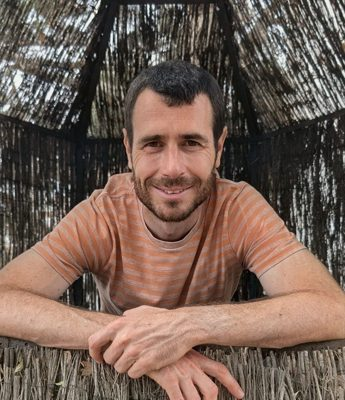
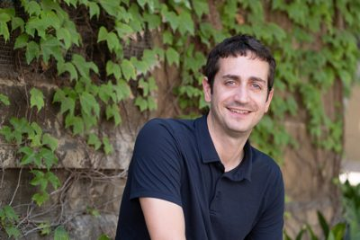
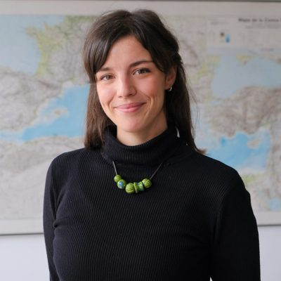
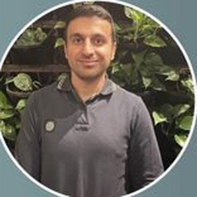

```{=html}
<style>
  .member {
    display: flex;
    gap: 1.1rem;
    align-items: flex-start;
    margin-bottom: 1.5rem;
  }
  .member-photo {
    width: 84px;
    height: 84px;
    border-radius: 50%;
    object-fit: cover;
    flex: none;
  }
  .member > p {
    margin: 0;
  }
  .member > p:first-of-type {
    flex: none;
  }
  .member > p:last-child {
    flex: 1;
  }
</style>
```

::: {style="text-align: justify; max-width: 860px; margin: 0 auto;"}

The team below has developed the **ATTCLIMATE** project (2022–2025) and continues its work under the newly funded **ATTCLIMPOLS** project (2026–2029).

## Principal Investigators

::: member
{.member-photo}

[**Marc Guinjoan (UAB)**](https://sites.google.com/site/marcguinjoan) is a co-principal investigator of the project. He is a lecturer in the Department of Political Science and Public Law at the Universitat Autònoma de Barcelona. His main research areas include political and electoral behavior, political parties, electoral systems, populism, and political psychology. He has also worked extensively on decentralization processes, identities, and territorial preferences.
:::

::: member
{.member-photo}

[**Toni Rodon (UPF)**](https://tonirodon.cat/) is a co-principal investigator of the project. Rodon is an Associate Professor at the Department of Political and Social Sciences at Universitat Pompeu Fabra, and a researcher at the London School of Economics and Political Science (United Kingdom). His research interests include political behavior, public opinion, historical political economy, and political geography, among others.
:::

---

## Current Team

::: member
{.member-photo}

[**Jordi Mas (UOC)**](https://www.jordimas.cat/) is a researcher in the project. Mas is a lecturer at the Faculty of Law and Political Science at the Universitat Oberta de Catalunya. His research interests include the fields of data governance, political economy and political institutions.
:::

::: member
{.member-photo}

**Elena Romanin** is a doctoral student in Political and Social Sciences at Universitat Pompeu Fabra. She has previously been a researcher at the Research and Expertise Centre for Survey Methodology (UPF), where she collaborated on the research project [ICOS Cities Pilot Applications in Urban Landscapes – Towards integrated city Observatories for greenhouse gases (PAUL)](https://www.icos-cp.eu/about/icos-in-nutshell/mission). She has completed the Master in Economics and Development at the University of Florence, and the Degree in International Studies at the University of Trento.
:::

::: member
{.member-photo}

**Gabriel Biering** is a PhD Candidate in the Department of Political Science at the Universitat Autònoma de Barcelona. He holds a research master's degree in Institutions and Political Economy M.Sc. (Universitat de Barcelona, 2024) and a bachelor's degree in Philosophy, Politics and Economics B.A. (Universität Witten/Herdecke, 2021). His research focuses on democratic responsiveness and climate change.
:::

::: member
{.member-photo}

**Joel Ardiaca** is a research assistant. He currently works as a statistician at the Centre for Opinion Studies and is pursuing a master's degree in Statistics and Operations Research at the Polytechnic University of Catalonia. He has completed a double degree in Statistics and Sociology at the Universitat Autònoma de Barcelona.
:::

::: member
{.member-photo}

**Nikandros Ioannidis** is PhD in Political and Social Sciences from the Universitat Pompeu Fabra and is Special Teaching Staff at the Cyprus University of Technology. His research focuses on political behaviour, public opinion, and the analysis of conflict- and climate-related attitudes using advanced quantitative and computational methods. He has extensive expertise in spatiotemporal analysis, geocoded data integration, and the construction of large-scale datasets.
:::

---

## Former Members

[**Roger Sanjaume**](https://rogersanjaume.cat/) was a data analyst programmer in the project. He currently works as a data engineer in an electric sector cooperative. He has collaborated with research projects such as the Institutions and Political Economy Research Group (IPErG) as a data analyst.

**Cèlia Estruch** was a research assistant in the project. She has completed the Master in Political Science and Political Economy at the London School of Economics and Political Science (United Kingdom), the postgraduate program in Data Analysis for Political Analysis and Public Management at the University of Barcelona, and a Degree in Philosophy, Politics, and Economics at Universitat Pompeu Fabra.

:::
